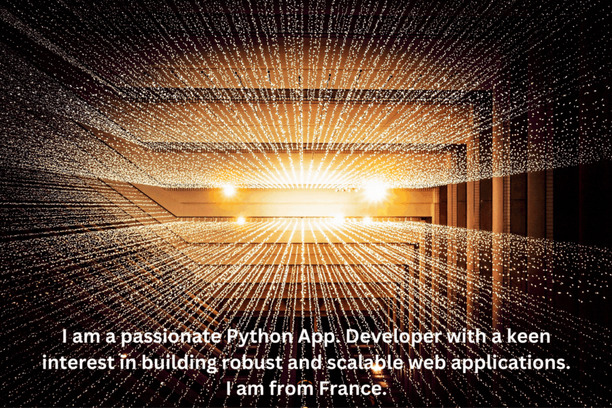

  

 

<h2>💻 Tech Stack</h2>

- **Programming Languages:**   
- **Markup Languages:**  
- **Stylesheet Languages:**   
- **Web Frameworks:**    
- **Frontend Frameworks:**  
- **Databases:**     
- **Version Control:**  
- **Other Tools:**           

<h2>💻 Projects</h2>

- **I just finished working on an application, for Artists' e-commerce and custom services gallery, called Live-Art-Corner. Click
[Live-Art-Corner](https://github.com/Gavin-Humphrey/liveartcorner), for github repo. And, [Live-Art-Corner](https://liveartcorner-5afce0fdefed.herokuapp.com/), for the website. Demo will be uploaded soonnest!**  

- **You can also click, [Film-Junkiez](https://github.com/Gavin-Humphrey/filmjunkiez), to find the github repo of, a film streaming and evaluation application called Film-Junkiez. And, [Film-Junkiez](https://film-junkiez-be8d3d00a54d.herokuapp.com/), for its website** 

  <h5>Demo</h5>
  

<h2>📇 Contact</h2>

-  

-   

  

  

<!-- GitHub Stats -->

  
  

<!-- 

    

 -->

